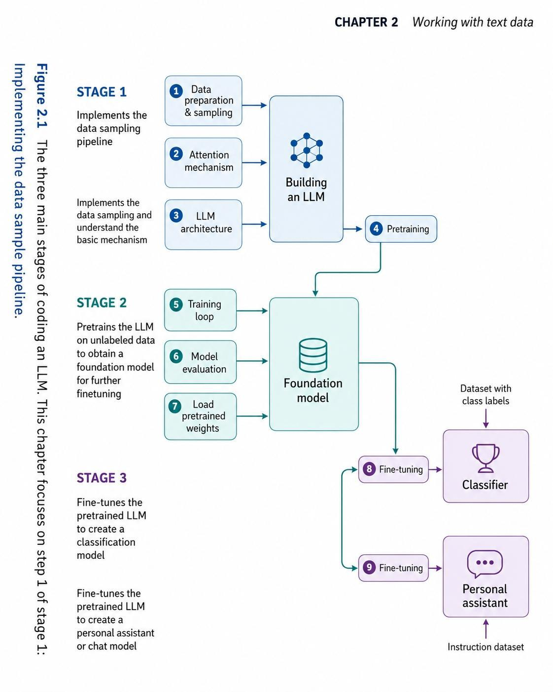

# Building LLMs From Scratch — Learning Journal

> Notes, experiments, and code from my reading of
> **"Build a Large Language Model (From Scratch)"** — *Sebastian Raschka*

---

## Overview

This repository documents my learning journey on how to build a **Large Language Model (LLM) from scratch**.
The goal is to understand what happens *inside* an LLM, not just use it as a black box.

The book breaks down the process into **3 main stages** :



> *Figure 2.1 — The three main stages of coding an LLM (source: Sebastian Raschka)*

---

## The 3 Stages

### Stage 1 — Build the model (`Building an LLM`)
Set up the data pipeline and the model architecture:
- **Data preparation & sampling** — Prepare and sample raw text data
- **Attention mechanism** — Implement the attention mechanism (the core of the Transformer)
- **LLM architecture** — Assemble the full model architecture

→ Output: a model ready for **pretraining** (step 4)

---

### Stage 2 — Pretrain the model (`Foundation Model`)
Train the LLM on unlabeled data to obtain a general-purpose base model:
- **Training loop** — Run the training loop
- **Model evaluation** — Evaluate model performance
- **Load pretrained weights** — Load existing pretrained weights

→ Output: a versatile **Foundation Model**

---

### Stage 3 — Fine-tune the model
Adapt the Foundation Model to specific downstream tasks:
- **Fine-tuning → Classifier** — Supervised classifier (with a labeled dataset)
- **Fine-tuning → Personal assistant** — Conversational assistant (with an instruction dataset)

---

## Repository Structure

```
build_llm_from_scratch/
├── assets/              # Figures and images from the book
├── stage_1/             # Chapter 2: Data preparation & sampling pipeline
└── README.md
```

---

## Resources

- Book: [Build a Large Language Model (From Scratch)](https://www.manning.com/books/build-a-large-language-model-from-scratch) — Sebastian Raschka
- Official book repo: [rasbt/LLMs-from-scratch](https://github.com/rasbt/LLMs-from-scratch)
