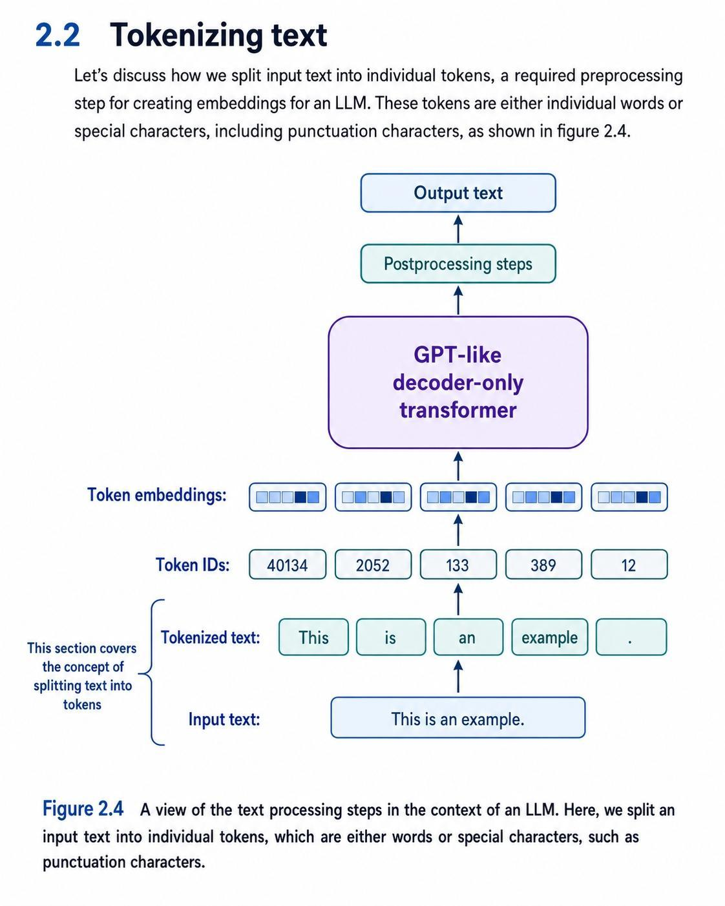
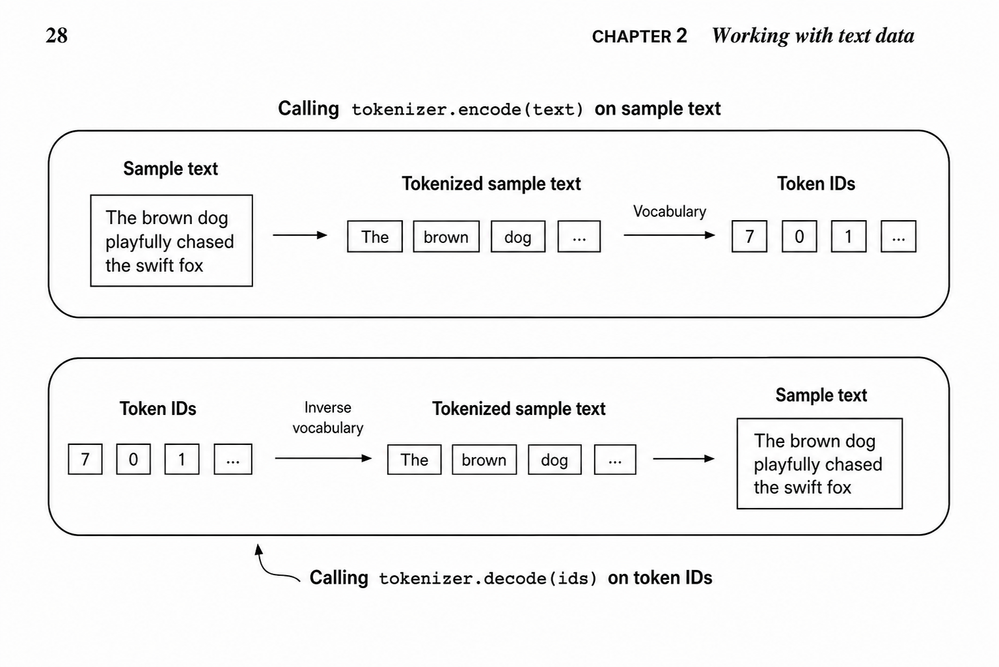
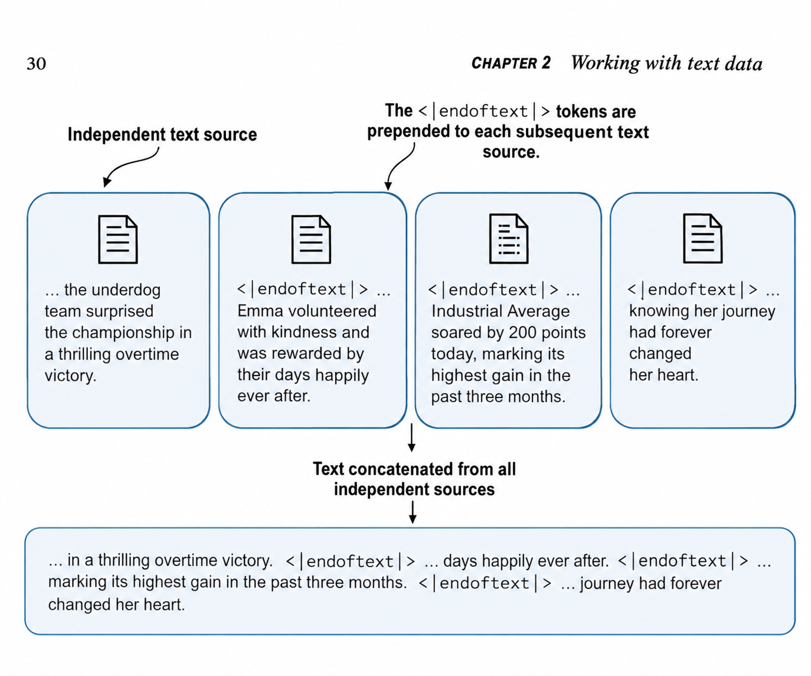

# Stage 1 — Data Preparation & Sampling Pipeline

---

## Overview

Stage 1 focuses on the **data preparation pipeline** — everything that happens *before* the model sees any data.
The core idea is: raw text cannot be fed directly into an LLM. It must be converted into numbers first.

The pipeline goes through the following steps:

```
Raw text  →  Tokenization  →  Token IDs  →  Token Embeddings  →  LLM
```

---

## Section 2.2 — Tokenizing Text



> *Figure 2.4 — A view of the text processing steps in the context of an LLM.
> Here, we split an input text into individual tokens, which are either words or
> special characters, such as punctuation characters.*

### What the figure shows

Starting from the bottom and going up:

| Step | Description |
|------|-------------|
| **Input text** | Raw string — e.g. `"This is an example."` |
| **Tokenized text** | The string is split into individual tokens: `["This", "is", "an", "example", "."]` |
| **Token IDs** | Each token is mapped to an integer via a vocabulary: `[40134, 2052, 133, 389, 12]` |
| **Token embeddings** | Each token ID is converted into a dense vector (a row of floating-point numbers) |
| **GPT-like decoder-only transformer** | The model processes the sequence of embeddings |
| **Postprocessing steps** | The model output is converted back into readable text |
| **Output text** | The final generated or processed text |

---

## The Problem

Neural networks are mathematical functions — they only operate on numbers.
Raw text is a sequence of characters: `"I HAD always thought Jack Gisburn rather a cheap genius..."`.
There is no direct way to feed this string into a matrix multiplication or a gradient descent update.

The challenge is: **how do you turn language into numbers in a way that preserves meaning?**
A naive approach (e.g. mapping each character to its ASCII code) loses all structure and context.
We need something smarter.

---

## The Intuition

Think of a dictionary. Every word has a unique entry number.
If you agree on the same dictionary with someone else, you can communicate using only numbers — and reconstruct the original message perfectly.

That is exactly what a **tokenizer + vocabulary** does:
- The tokenizer splits text into atomic units called **tokens** (words, subwords, punctuation)
- The vocabulary assigns a unique integer **ID** to each token
- The result is a sequence of integers the model can process mathematically

But integers alone are still too rigid — the number `42` is not "close" to `43` in any meaningful linguistic sense.
So we go one step further: each integer is mapped to a **dense vector** (token embedding), where similar tokens end up with similar vectors. This is where meaning begins to emerge.

---

## The Solution

The data preparation pipeline solves the problem in three steps:

**1. Tokenization**
Split the raw text into tokens using a tokenizer (e.g. a simple whitespace/punctuation splitter, or a BPE tokenizer like GPT-2's).

```python
# Example: "This is an example." → ["This", "is", "an", "example", "."]
```

**2. Vocabulary mapping (Token IDs)**
Build a vocabulary from the training corpus and map each token to a unique integer ID.

```python
# Example: {"This": 40134, "is": 2052, "an": 133, "example": 389, ".": 12}
# → [40134, 2052, 133, 389, 12]
```

**3. Token Embeddings**
Pass each token ID through an embedding layer that converts it into a dense floating-point vector.
These vectors are *learned* during training — they are not fixed.

```python
# Each token ID → vector of size d_model (e.g. 768 dimensions for GPT-2 small)
```

---

## Application

In `tokenizer.py`, the first concrete step of this pipeline is implemented:

```python
# Download the training text
urllib.request.urlretrieve(url, file_path)

# Read and inspect the raw data
with open(file_path, "r", encoding="utf-8") as f:
    raw_text = f.read()

print("Total number of character:", len(raw_text))  # → 20,479 characters
print(raw_text[:99])
# → "I HAD always thought Jack Gisburn rather a cheap genius--though a good fellow enough--so it was no"
```

**What this tells us:**
- The dataset (*The Verdict* by Edith Wharton) contains **20,479 characters**
- It is a short story — small enough to experiment with on a laptop, large enough to demonstrate the full pipeline
- The next steps will tokenize this text, build a vocabulary, and convert it into token IDs ready for the model

---

## SimpleTokenizerV1 — Encode & Decode



> *Illustration of `tokenizer.encode(text)` (top) and `tokenizer.decode(ids)` (bottom)*

The `SimpleTokenizerV1` class implements the two core operations of any tokenizer:

### `encode(text)` — Text → Token IDs

```python
def encode(self, text):
    preprocessed = re.split(pattern, text)
    preprocessed = [item.strip() for item in preprocessed if item.strip()]
    IDs = [self.str_to_int[item] for item in preprocessed]
    return IDs
```

1. Split the input string into tokens using the regex pattern (whitespace + punctuation)
2. Strip and filter empty tokens
3. Map each token to its integer ID using `str_to_int` (the vocabulary)

→ `"The brown dog"` becomes `[7, 0, 1, ...]`

---

### `decode(ids)` — Token IDs → Text

```python
def decode(self, ids):
    text = " ".join([self.int_to_str[id] for id in ids])
    text = re.sub(r'\s+([,.?!"()\'])', r'\1', text)
    return text
```

1. Convert each ID back to its token using `int_to_str` (the **inverse vocabulary**)
2. Join all tokens with spaces
3. Clean up spaces before punctuation marks (e.g. `word ,` → `word,`)

→ `[7, 0, 1, ...]` becomes `"The brown dog..."`

---

### The two vocabularies

| Attribute | Type | Direction | Built from |
|-----------|------|-----------|------------|
| `self.str_to_int` | `dict` | token → ID | `vocab` passed at init |
| `self.int_to_str` | `dict` | ID → token | inverted from `vocab` |

The **inverse vocabulary** is created automatically in `__init__`:
```python
self.int_to_str = {i: s for s, i in vocab.items()}
```

This symmetry is what makes encode/decode perfectly reversible — as long as all tokens in the input exist in the vocabulary.

---

## Special Tokens



> *The <|endoftext|> token is prepended to each subsequent text source when concatenating multiple independent documents into a single training corpus.*

### Why special tokens?

When building a tokenizer, two fundamental problems arise:

**Problem 1 — Out-of-Vocabulary (OOV) words**
If the model encounters a word not seen during training, the vocabulary has no ID for it → `KeyError`.

**Problem 2 — Document boundaries**
When training on multiple documents concatenated into one long sequence, the model needs to know where one document ends and another begins.

Special tokens solve both problems by reserving dedicated slots in the vocabulary.

---

### Tokens implemented in SimpleTokenizerV2

| Token | ID | Role |
|-------|----|------|
| `<|unk|>` | 1139 | Replaces any word not found in the vocabulary |
| `<|endoftext>` | 1140 | Marks the boundary between two independent documents |

```python
# Adding special tokens to the vocabulary
all_tokens.extend(["<|unk|>", "<|endoftext>"])
vocab = {token: integer for integer, token in enumerate(all_tokens)}
```

In `encode()`, the special tokens are isolated **before** the regex split (to prevent punctuation splitting from breaking them apart), then unknown words are replaced with `<|unk|>`:

```python
# Step 1: isolate special tokens first — keep them intact
parts = re.split(r'(<\|endoftext>|<\|unk\|>)', text)
for part in parts:
    if part in ('<|endoftext>', '<|unk|>'):
        preprocessed.append(part)        # kept as-is
    else:
        tokens = re.split(pattern, part) # normal regex split on regular text
        preprocessed.extend([t.strip() for t in tokens if t.strip()])

# Step 2: replace remaining unknown words with <|unk|>
preprocessed = [item if item in self.str_to_int else "<|unk|>" for item in preprocessed]
```

**Result:**

- `Hello` → `<|unk|>` (not in *The Verdict* vocabulary)
- `palace` → `<|unk|>` (not in *The Verdict* vocabulary)
- `<|endoftext>` → preserved with its own ID `1140`

---

### Other special tokens used by researchers

Different models and frameworks use different sets of special tokens depending on their architecture:

| Token | Full name | Role |
|-------|-----------|------|
| `[BOS]` | Begin Of Sequence | Marks the start of a text sequence |
| `[EOS]` | End Of Sequence | Marks the end of a text sequence |
| `[PAD]` | Padding | Fills shorter sequences in a batch to match the longest one |
| `<|unk|>` | Unknown | Replaces out-of-vocabulary tokens |
| `<|endoftext|>` | End Of Text | Separates independent documents (used by GPT) |

**Why `[PAD]`?**
During training, LLMs process text in batches. All sequences in a batch must have the same length.
If one sequence is shorter than the others, `[PAD]` tokens are appended to fill it up to the batch length.

---

### What GPT actually uses

> GPT models (GPT-2, GPT-3, GPT-4) take a different approach — simpler and more powerful:

| Feature | Our SimpleTokenizerV2 | GPT |
|---------|----------------------|-----|
| OOV handling | `<|unk|>` token | No `<|unk|>` — uses **Byte Pair Encoding (BPE)** |
| Document boundary | `<|endoftext>` | `<|endoftext|>` |
| Padding | N/A | N/A (uses attention masks) |
| Special tokens | `<|unk|>`, `<|endoftext>` | Only `<|endoftext|>` |

**Why no `<|unk|>` in GPT?**
GPT uses **Byte Pair Encoding (BPE)** as its tokenizer. BPE never encounters an unknown token because it can always fall back to encoding any character at the byte level — every possible input can be represented, even emojis or rare characters.

We will explore BPE in detail in the next section.

---

## Key Concepts

- **Tokenization** — Splitting text into units (tokens) the model can work with. Tokens can be words, subwords, or individual characters depending on the tokenizer.
- **Vocabulary** — A fixed mapping from tokens to integer IDs. GPT-2 uses a vocabulary of ~50,257 tokens (50,000 BPE merges + 256 byte tokens + 1 special token).
- **Special tokens** — Reserved vocabulary entries that carry structural meaning (`<|unk|>`, `<|endoftext|>`, `[PAD]`, etc.)
- **Out-of-vocabulary (OOV)** — Words not present in the vocabulary. Simple tokenizers use `<|unk|>`; GPT uses BPE to avoid this entirely.
- **Byte Pair Encoding (BPE)** — A subword tokenization algorithm that eliminates OOV by iteratively merging frequent character pairs. Used by GPT-2 and GPT-3. *(Covered next.)*
- **Token embeddings** — Dense vector representations of token IDs, learned during training.
- **Decoder-only Transformer** — The architecture used by GPT-style models.
